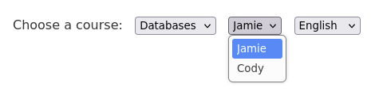
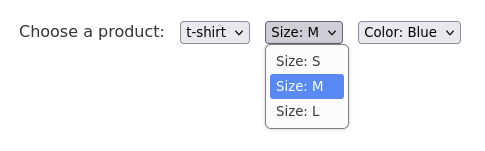
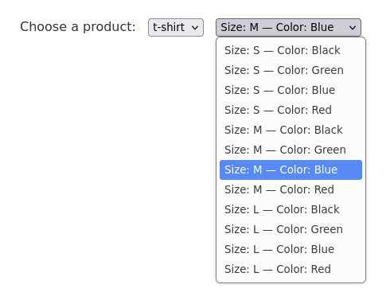

#+title: Fourth normal form
#+date: <2025-05-25 Вс>
#+tags: Databases

#+begin_export html
<link rel="stylesheet" href="local-styles.css">
#+end_export

For some reason 4NF is widely considered obscure, unimportant, rarely encountered, impractical, while 3NF is regarded as [[https://stackoverflow.com/questions/6625569/what-is-the-level-of-database-normalization-that-is-practically-enough][enough]]. I'm not sure where this misunderstanding comes from. I'm not even exaggerating, it's an old issue, here's a paper from 1992: [[https://dl.acm.org/doi/10.1145/134510.134515]["The practical need for fourth normal form"]].

If I were to write a database course, I'd start with 4NF, as it's the easieast one of them all, it can be explained visually by showing drop-down lists on an html form, where /the first field determines what's shown in other options/.

** Unnecessary combinations

Let's say we have a page for students to choose a course, an instructor, and available languages. The options could look like this when you choose databases:

#+ATTR_HTML: :class my-img-centered

The corresponding table would be:

#+begin_export html
<table class="my-table">
    <thead>
        <tr>
            <th>Course</th>
            <th>Instructor</th>
            <th>Language</th>
        </tr>
    </thead>
    <tbody>
        <tr>
            <td>Databases</td>
            <td>Jamie</td>
            <td>English</td>
        </tr>
        <tr>
            <td>Databases</td>
            <td>Jamie</td>
            <td>German</td>
        </tr>
        <tr>
            <td>Databases</td>
            <td>Cody</td>
            <td>English</td>
        </tr>
        <tr>
            <td>Databases</td>
            <td>Cody</td>
            <td>German</td>
        </tr>
    </tbody>
</table>
#+end_export

Or we could break it down and let students choose an instructor and a language separately:

#+ATTR_HTML: :class my-img-centered

The tables would be:

#+begin_export html
<table class="my-table">
    <thead>
        <tr>
            <th>Course</th>
            <th>Instructor</th>
        </tr>
    </thead>
    <tbody>
        <tr>
            <td>Databases</td>
            <td>Jamie</td>
        </tr>
        <tr>
            <td>Databases</td>
            <td>Cody</td>
        </tr>
    </tbody>
</table>
#+end_export

#+begin_export html
<table class="my-table">
    <thead>
        <tr>
            <th>Course</th>
            <th>Language</th>
        </tr>
    </thead>
    <tbody>
        <tr>
            <td>Databases</td>
            <td>English</td>
        </tr>
        <tr>
            <td>Databases</td>
            <td>German</td>
        </tr>
    </tbody>
</table>
#+end_export

But what if you choose philosophy, and teaching it is too hard in a foreigh language? Kris can only do it in English, and Sophia only in French:

#+ATTR_HTML: :class my-img-centered

The corresponding part of the table would be:

#+begin_export html
<table class="my-table">
    <thead>
        <tr>
            <th>Course</th>
            <th>Instructor</th>
            <th>Language</th>
        </tr>
    </thead>
    <tbody>
        <tr>
            <td>Philosophy</td>
            <td>Kris</td>
            <td>English</td>
        </tr>
        <tr>
            <td>Philosophy</td>
            <td>Sophia</td>
            <td>French</td>
        </tr>
    </tbody>
</table>
#+end_export

Then we can't break it down like we were going to before. If we did break it down, we would have to convey the information that, e.g., Sophia doesn't teach philosophy in English some other way, like by showing an error message and politely asking to pick another option. Or we can decide to let students choose and listen to Kris and Sophia awkwardly philosophizing in their non-native languages.

If we were talking about relations, this would be about whether or not to break down (course, instructor, language) into (course, instructor) and (course, language) in order to avoid having a lot of redundant combinations of instructors and languages in the table.

That's all what 4NF is about: if we can break a relation down to avoid unnecessary combinations, then we should, because it's a 4NF violation. If we can't, then we shouldn't.

** Lots of combinations

The following example is slightly contrived, because in reality this would be much more complex and interesting, but it illustrates the point. If we were designing a schema for a sportswear store, we would probably end up with something like this:

#+ATTR_HTML: :class my-img-centered

And not this, which is bad UX and violates 4NF:

#+ATTR_HTML: :class my-img-centered

Here the relations would be (product, size) and (product, color) instead of (product, size, color), because the latter would have all the combinations of sizes and colors redundantly. Imagine the number of entries in this list if there were even more sizes and colors, and if we added printed image and other features to the relation.

** Maintaining integrity

Why do we even care about 4NF violation? Because, for example, changing an available color from green to yellow would have to be done in multiple rows instead of one.

It doesn't seem like a big deal, but at larger scale maintaining integrity in application logic rather than in schema design is error-prone and without a reason should be avoided. Usually the reason is performance, but it has to be measured first before making trade-offs.

** Why are some explanations so weird?

Lastly, there are examples of 4NF violation that can be found in the internet that are outright weird and confusing, because they are taken out of context and teach nothing.

Here are two absolutely independent lists that simply shouldn't be in one table side by side, namely student's courses and hobbies:

#+begin_export html
<table class="my-table">
    <thead>
        <tr>
            <th>Student</th>
            <th>Course</th>
            <th>Hobby</th>
        </tr>
    </thead>
    <tbody>
        <tr>
            <td>Jason</td>
            <td>Algorithms</td>
            <td></td>
        </tr>
        <tr>
            <td>Jason</td>
            <td>Databases</td>
            <td></td>
        </tr>
        <tr>
            <td>Jason</td>
            <td>Calculus</td>
            <td></td>
        </tr>
        <tr>
            <td>Jason</td>
            <td></td>
            <td>Running</td>
        </tr>
        <tr>
            <td>Jason</td>
            <td></td>
            <td>Photography</td>
        </tr>
    </tbody>
</table>
#+end_export

Sometimes presented like this, which is cryptic, these combinations make no sense:

#+begin_export html
<table class="my-table">
    <thead>
        <tr>
            <th>Student</th>
            <th>Course</th>
            <th>Hobby</th>
        </tr>
    </thead>
    <tbody>
        <tr>
            <td>Jason</td>
            <td>Algorithms</td>
            <td>Running</td>
        </tr>
        <tr>
            <td>Jason</td>
            <td>Databases</td>
            <td>Running</td>
        </tr>
        <tr>
            <td>Jason</td>
            <td>Calculus</td>
            <td>Photography</td>
        </tr>
    </tbody>
</table>
#+end_export

No one in their right mind would ever design a table like this. Yet this is discussed in some guides, and surprizingly or not, but there is a reason why, which is never given though, and as it happens, it's historical. The following great blog post sheds light: [[https://www.cargocultcode.com/normalization-is-not-a-process/]["Normalization is not a process"]].

Basically, tables like this are artifacts of a particular process, which is taught in traditional courses, often without a clear explanation why it is taught at all.

Well, back in the day, when relational databases were first introduced, there had to be a way to migrate from existing hierarchical storage without losing information. It involves taking all the attributes that can be found in data, and putting them in one huge relation and then iteratively breaking it down into smaller relations until there's nothing to split. The process itself is fine and really useful in certain circumstances, but it's purely mechanistical and doesn't give any insights, and sometimes intermediate tables look like shown above before being broken down. 

We don't have to stick to this process when we don't migrate from hierarchical storage. When we design schemas, relations that just make sense turn out to be fine most of the time.

** Good news

A lot of schemas are in 4NF unknowingly, because it's so intuitive to avoid unnecesary combinations.

Another nice thing to know about 4NF is "only in rare situations does a 4NF table not conform to 5NF", quote from [[https://en.wikipedia.org/wiki/Fifth_normal_form#Usage][wikipedia]]. One less thing to worry about.

** Conclusion

I believe this and other misunderstandings can be cleared by providing better examples and restructuring courses.

And I'm not sure 4NF is completely unimportant, because we use a simple theory that gives some guarantees about data integrity, and knowing its limits is not that unhelpful.

P.S. I hope clicking on screenshots is not too frustrating haha.

** Fourth normal form                   :blog:noexport:
[2025-05-25 Вс]

