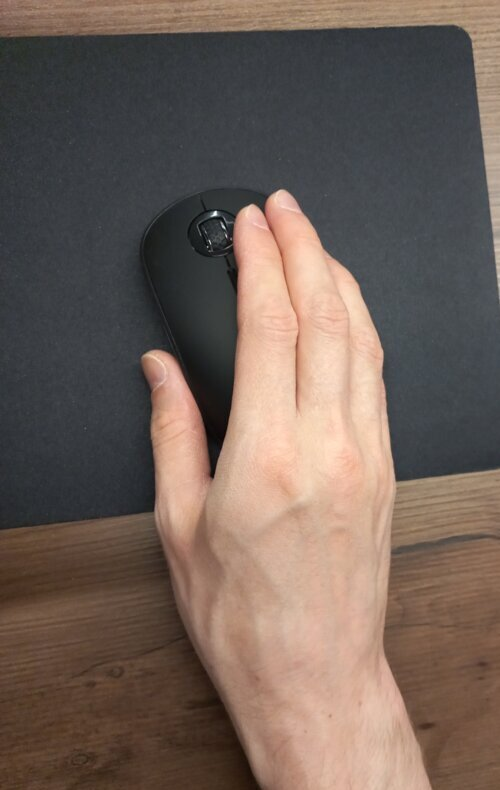
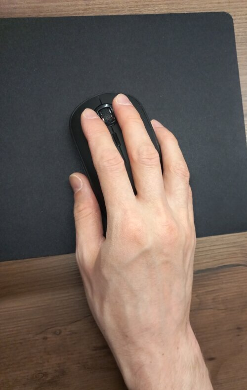

#+title: Two-finger mouse clicking against RSI
#+date: <2026-04-05 Вс>

Around three years ago I got scrolling-induced RSI, which is Repetitive Strain Injury.

Basically, I hurt my hand by using the mouse wheel too much.

I was obsessed with trying to learn more about how transformers work in LLMs. I had been scrolling back and forth through papers, code, and explanations for many days on end, far more than I usually do, since the amount of context I need to grasp at once is normally much smaller.

At some point, I couldn't use the mouse anymore due to pain. So I had to go to a store and try out an ergonomic vertical mouse. Luckily, the staff didn't object and let me do this. Well, I didn't buy it. It didn't help at all, because my hand still hurt with every movement, including clicking.

Then, after a bit of experimenting, I came up with the following: I swapped the mouse buttons in the settings, so it's now configured as left-handed, and I click the primary button with two fingers.

It looks weird, but it reduces strain on my hand significantly.

The index finger moves to the regular position for a brief moment to click the secondary button. Unfortunately, this is not for gaming or 3D modeling. 

I have to add that the mouse should not be flat, because otherwise it's too much strain on the pinky when I lift it for movement.

Also, I bought an external numpad to scroll with my left hand occasionally.

It took many months for my hand to heal, but it did eventually, and I'm sharing this because I haven't found anything similar online. Hopefully, this will be helpful to someone else.

*** mouse rsi                           :blog:noexport:
[2026-04-08 Ср]

